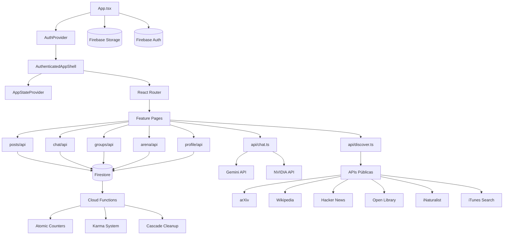
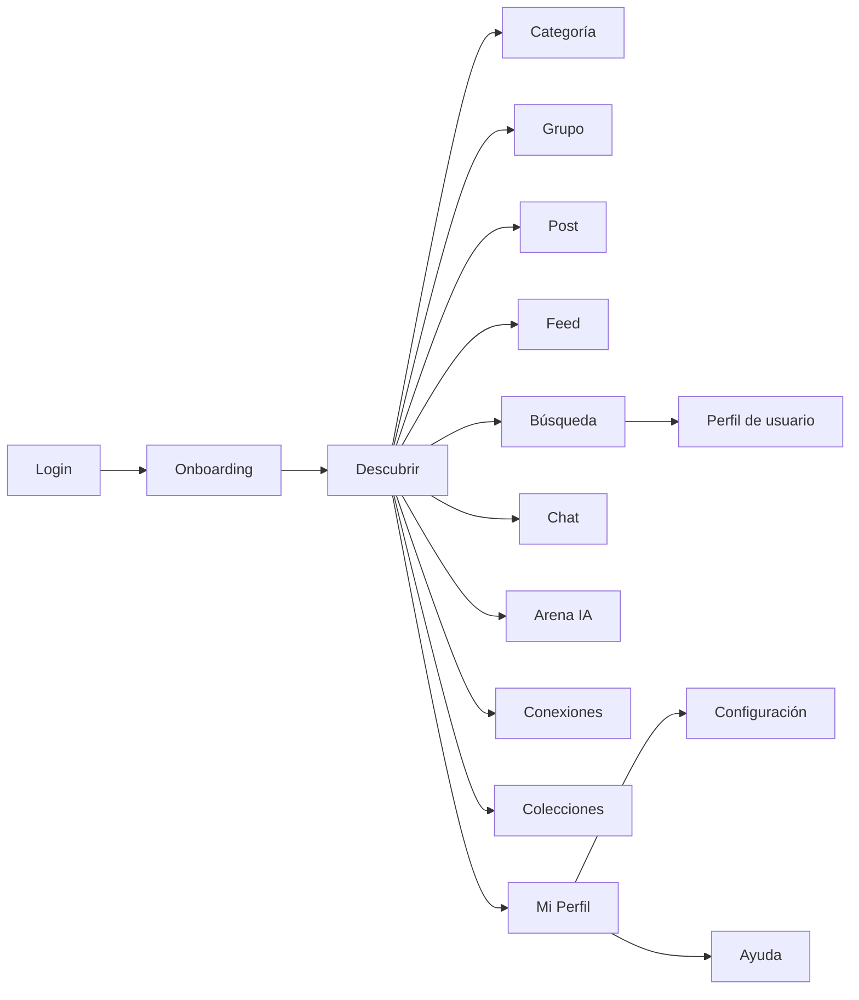

<p align="center">
  
</p>

# Vinctus

Red social basada en intereses. Conecta con comunidades de ciencia, música, historia y más.

## Estado del proyecto

Aplicación en producción desplegada en **Vercel** con backend completo en **Firebase** (Auth, Firestore, Storage, Cloud Functions). Incluye autenticación real, datos persistentes, mensajería en tiempo real y capacidades de IA.

## Características

- **Descubrimiento** — Exploración por categorías (ciencia, música, historia, tecnología, etc.) con contenido de APIs públicas y publicaciones de la comunidad.
- **Feed y publicaciones** — Creación de posts con texto e imágenes, likes, comentarios, guardado y compartir.
- **Historias** — Historias efímeras (24h) visibles solo para amigos.
- **Grupos** — Creación y gestión de grupos con roles (admin, moderador, miembro), edición y chat grupal.
- **Chat en tiempo real** — Conversaciones privadas y grupales con actualizaciones en tiempo real vía Firestore.
- **Perfil y red social** — Perfiles editables, seguidores, seguidos, amigos con solicitudes de amistad, cuentas privadas.
- **Arena IA** — Debates generados por inteligencia artificial (Gemini / NVIDIA) entre dos personajes sobre temas personalizados.
- **Chat IA** — Conversación directa con modelos de IA (Gemini, NVIDIA Kimi K2).
- **Búsqueda de usuarios** — Búsqueda global de usuarios registrados con vista de perfil.
- **Notificaciones** — Feed de actividad (likes, comentarios, solicitudes de amistad).
- **Colecciones** — Biblioteca personal para guardar enlaces, notas y archivos organizados en carpetas.
- **Portafolio** — Sección de contribuciones (proyectos, papers, certificados).
- **Eventos** — Creación y asistencia a eventos con contadores atómicos.
- **Bloqueo y reportes** — Sistema de bloqueo de usuarios y reportes de abuso.
- **Configuración** — Tema claro/oscuro, privacidad, notificaciones, cambio de contraseña.
- **Centro de ayuda** — Envío de tickets de soporte y solicitudes de features.
- **PWA** — Instalable como aplicación móvil con Service Worker.
- **Diseño responsive** — Desktop + mobile con navegación adaptativa.
- **Onboarding** — Tutorial guiado para nuevos usuarios.

## Capturas

**Descubrir - Intereses**


**Descubrir - Grupos recomendados**


**Descubrir - Publicaciones**


## Arquitectura



**Flujo de usuario**



## Requisitos

- Node.js >= 20
- npm

## Instalación y uso

```bash
npm install
npm run dev
```

Abre `http://localhost:5173`.

Para previsualizar el build:

```bash
npm run build
npm run preview
```

## Desarrollo local con emuladores

```bash
npm run dev:local
```

Inicia Firebase Emulator Suite (Auth/Firestore/Storage/Functions), aplica el seed y levanta Vite en `http://localhost:5173`.
Emulator UI: `http://localhost:4000`.

Usuarios seed (email / password):

- `alice@vinctus.local` / `password123`
- `bob@vinctus.local` / `password123`
- `carla@vinctus.local` / `password123`

## Scripts útiles

| Script                         | Descripción                                                        |
| ------------------------------ | ------------------------------------------------------------------ |
| `npm run dev`                  | Desarrollo con Vite                                                |
| `npm run dev:local`            | Emuladores + seed + Vite                                           |
| `npm run build`                | Build de producción (typecheck + vite build)                       |
| `npm run preview`              | Preview del build                                                  |
| `npm run lint`                 | ESLint                                                             |
| `npm run typecheck`            | TypeScript sin emitir                                              |
| `npm run check:cycles`         | Detecta ciclos de dependencias en `src`                            |
| `npm run check:stubs`          | Valida fecha de caducidad + ticket en stubs                        |
| `npm run check:raw-onsnapshot` | Detecta usos directos de `onSnapshot`                              |
| `npm run guardrails`           | lint + ciclos + stubs + onSnapshot                                 |
| `npm run test`                 | Vitest en modo watch                                               |
| `npm run test:run`             | Vitest en modo CI                                                  |
| `npm run test:api`             | Tests de endpoints serverless en `api/` (`chat`, `discover`)       |
| `npm run test:coverage`        | Tests con reporte de cobertura                                     |
| `npm run test:rules`           | Tests de Firestore rules (requiere emuladores)                     |
| `npm run test:e2e`             | Playwright E2E                                                     |
| `npm run test:e2e:smoke`       | Playwright smoke tests                                             |
| `npm run lhci`                 | Lighthouse CI (build + collect + assert)                           |
| `npm run validate`             | Pipeline completo: typecheck + lint + coverage + api tests + build |
| `npm run ci`                   | Alias de validate                                                  |
| `npm run emulators`            | Firebase emuladores                                                |
| `npm run seed`                 | Seed de datos en emuladores                                        |
| `npm run functions:install`    | Instala deps de Cloud Functions                                    |
| `npm run functions:build`      | Build de Cloud Functions                                           |

## Testing

- **Unit tests**: Vitest con meta de cobertura ≥ 85% (statements/functions/lines)
- **API tests**: `npm run test:api` — endpoints `api/chat.ts` y `api/discover.ts`
- **Firestore rules tests**: `npm run test:rules` — con emuladores Firebase
- **E2E**: Playwright — flujos críticos (login, feed, chat, grupos)
- **Lighthouse CI**: Home/Feed/Chat/Groups con umbral ≥ 0.90

## Variables de entorno

Copia `.env.example` a `.env.local` y completa lo necesario:

### Firebase (requerido)

- `VITE_FIREBASE_API_KEY` — API key del proyecto Firebase
- `VITE_FIREBASE_AUTH_DOMAIN` — Dominio de autenticación
- `VITE_FIREBASE_PROJECT_ID` — ID del proyecto
- `VITE_FIREBASE_STORAGE_BUCKET` — Bucket de Storage
- `VITE_FIREBASE_MESSAGING_SENDER_ID` — ID del sender
- `VITE_FIREBASE_APP_ID` — ID de la aplicación

### Emuladores (opcional)

- `VITE_USE_FIREBASE_EMULATOR` — `true` para usar emuladores en local
- `VITE_FIREBASE_EMULATOR_HOST` — Host para emuladores (default `127.0.0.1`)

### Discover APIs (opcional)

- `VITE_CORS_PROXY` — Proxy CORS de fallback para desarrollo local cuando `/api/discover` no está disponible
- `VITE_MUSIC_COUNTRY` — País para fallback directo de música en cliente (default `US`)
- `DISCOVER_MUSIC_COUNTRY` — País para proveedor de música del endpoint server-side `api/discover` (default `US`)

### Server-side AI (variables de servidor, no expuestas al cliente)

- `GEMINI_API_KEY` — API key de Google Gemini
- `GEMINI_TIMEOUT_MS` — Timeout para llamadas a Gemini (default 12000)
- `NVIDIA_API_KEY` — API key de NVIDIA
- `NVIDIA_BASE_URL` — URL base de la API NVIDIA
- `NVIDIA_MODEL` — Modelo a usar (default `moonshotai/kimi-k2-instruct`)
- `CHAT_USER_MINUTE_LIMIT` / `CHAT_USER_DAY_LIMIT` — Rate limits por usuario
- `CHAT_IP_MINUTE_LIMIT` / `CHAT_IP_DAY_LIMIT` — Rate limits por IP

## APIs externas

Se consumen APIs públicas (sin API key) para contenido en vivo:

- **arXiv** — Ciencia
- **Wikipedia** — Historia
- **Hacker News** — Tecnología
- **Open Library** — Literatura
- **iNaturalist** — Naturaleza
- **iTunes Search API** — Música

Estas fuentes se consumen por `api/discover` (server-side proxy con caché) para evitar CORS en el cliente y reducir latencia/costos.
En local, existe fallback directo en cliente y proxy CORS configurable.

## Estructura del proyecto

```
vinctus/
├── src/
│   ├── app/                    # Capa de aplicación
│   │   ├── providers/          # AuthContext, AppState, Toast
│   │   ├── routes/             # AppLayout, Header, AuthenticatedAppShell
│   │   └── services/           # Servicios compartidos de aplicación
│   ├── features/               # Módulos de dominio (Feature-Sliced)
│   │   ├── ai/                 # Chat IA
│   │   ├── arena/              # Arena de debates IA
│   │   ├── auth/               # Login, registro, onboarding
│   │   ├── chat/               # Mensajería en tiempo real
│   │   ├── collaborations/     # Colaboraciones
│   │   ├── collections/        # Colecciones / Biblioteca
│   │   ├── discover/           # Descubrimiento y categorías
│   │   ├── events/             # Eventos
│   │   ├── groups/             # Grupos
│   │   ├── help/               # Centro de ayuda
│   │   ├── notifications/      # Notificaciones
│   │   ├── posts/              # Publicaciones, feed, historias
│   │   ├── profile/            # Perfil, seguidores, amigos
│   │   ├── projects/           # Conexiones / Portafolio
│   │   └── settings/           # Configuración y privacidad
│   ├── shared/                 # Código compartido (no importa features ni app)
│   │   ├── constants/          # Constantes globales
│   │   ├── hooks/              # Hooks reutilizables (useApiContent)
│   │   ├── lib/                # Firebase, errores, validación, storage, helpers
│   │   ├── types/              # Tipos compartidos
│   │   └── ui/                 # Componentes UI (Toast, ErrorBoundary, Skeleton)
│   ├── context/                # Contextos legacy
│   ├── App.tsx                 # Componente raíz
│   ├── main.tsx                # Punto de entrada
│   └── index.css               # Estilos globales
├── api/                        # Serverless functions (Vercel)
│   ├── chat.ts                 # Endpoint IA (Gemini + NVIDIA)
│   └── discover.ts             # Proxy/caché de APIs públicas para Discover
├── functions/                  # Cloud Functions (Firebase)
│   └── src/index.ts            # Triggers, contadores atómicos, karma, cleanup
├── e2e/                        # Tests E2E (Playwright)
├── scripts/                    # Scripts de CI, seed, métricas, Lighthouse
├── docs/                       # Documentación y screenshots
├── firestore.rules             # Reglas de seguridad de Firestore (1685 líneas)
├── storage.rules               # Reglas de seguridad de Storage
├── firestore.indexes.json      # Índices compuestos de Firestore
├── firebase.json               # Configuración de Firebase
├── vercel.json                 # Configuración de Vercel (headers de seguridad, SPA rewrites)
├── eslint.config.js            # ESLint con boundary enforcement entre capas
├── tailwind.config.js          # Tailwind CSS
├── vite.config.ts              # Vite + PWA
├── playwright.config.ts        # Playwright E2E
├── vitest.config.ts            # Vitest unit tests
└── tsconfig.json               # TypeScript strict mode
```

Cada módulo en `features/` sigue la convención:

```
features/<dominio>/
├── api/                # queries.ts, mutations.ts, types.ts (+ tests)
├── components/         # Componentes del dominio
└── pages/              # Páginas del dominio
```

## Cloud Functions

Triggers de Firestore para operaciones server-side:

- **Contadores atómicos** — `memberCount`, `likesCount`, `attendeesCount` con deduplicación
- **Sistema de karma** — Reputación calculada por likes recibidos
- **Contadores de follow** — `followersCount`, `followingCount`
- **Cascade cleanup** — Limpieza de subcolecciones al eliminar grupos, eventos o usuarios
- **Friend index** — Índice de amigos al aceptar solicitudes
- **Group conversations** — Auto-creación de conversaciones grupales

## Calidad y CI

- **TypeScript strict** — `strictNullChecks`, `noImplicitAny`, `noUnusedLocals`
- **ESLint boundary enforcement** — `shared` no importa `features`/`app`, `features` no importa `app`
- **Validación con Zod** — Schemas de validación en todas las API de dominio
- **Clase AppError** — Manejo de errores con mapeo Firebase → códigos de app
- **Retry + Timeout** — Helpers de resiliencia para operaciones de red
- **Lighthouse CI** — Gates de performance ≥ 0.90 en páginas clave
- **Git hooks** — `lint-staged` + `prettier` en pre-commit
- **Cobertura** — Meta ≥ 85% en statements/functions/lines

## Headers de seguridad (Vercel)

- `X-Content-Type-Options: nosniff`
- `X-Frame-Options: DENY`
- `X-XSS-Protection: 1; mode=block`
- `Referrer-Policy: strict-origin-when-cross-origin`
- `Strict-Transport-Security: max-age=31536000; includeSubDomains; preload`

## Stack tecnológico

- **Frontend**: React 19 + Vite 6 + TypeScript 5
- **Estilos**: Tailwind CSS 3 + tailwindcss-animate
- **Routing**: React Router DOM 7
- **Backend**: Firebase (Auth, Firestore, Storage, Cloud Functions)
- **IA**: Google Gemini API + NVIDIA API (Kimi K2)
- **Hosting**: Vercel (SPA + serverless functions)
- **Iconos**: Lucide React
- **Validación**: Zod 4
- **PWA**: vite-plugin-pwa
- **Testing**: Vitest + Playwright + Lighthouse CI
- **Tipografía**: Inter + Playfair Display (Google Fonts)

## Licencia

MIT
