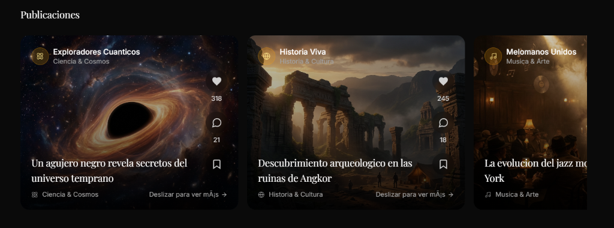
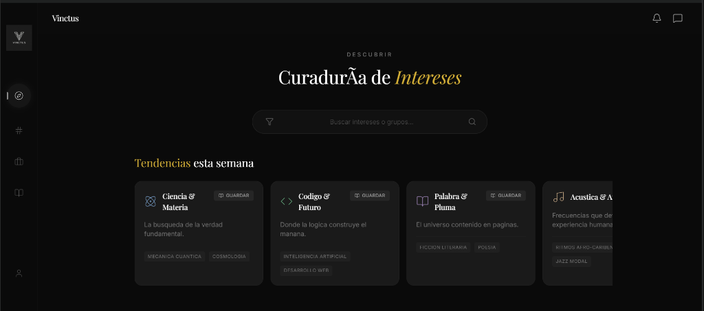
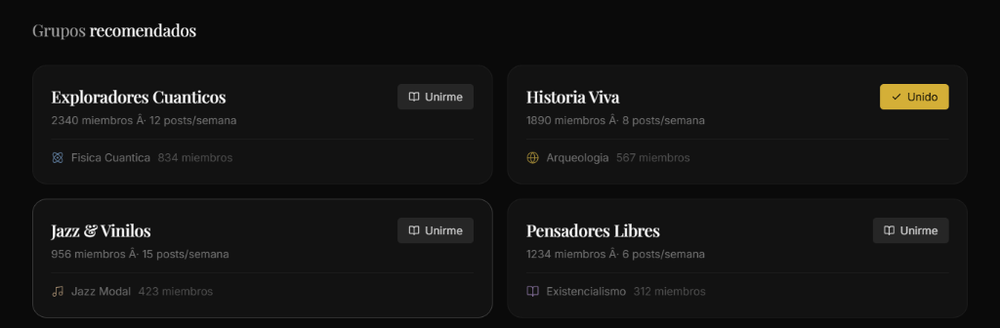
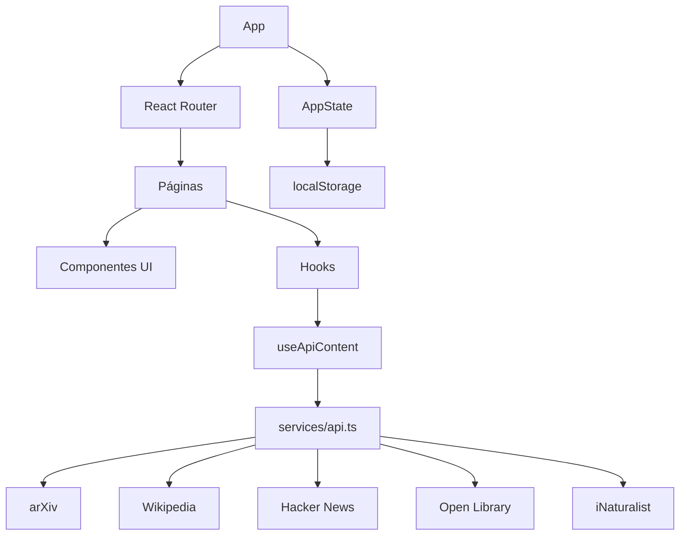
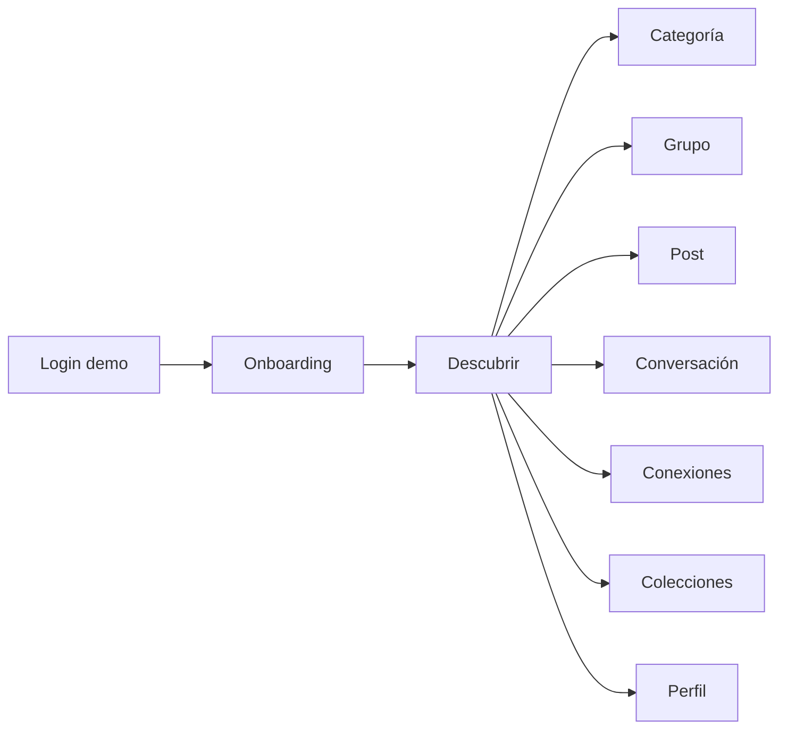

<p align="center">
  
</p>
# Vinctus

Red social basada en intereses. Conecta con comunidades de ciencia, música, historia y más.

## Estado del proyecto

MVP de interfaz con datos mock e integraciones públicas. No incluye backend de autenticación real.

## Características

- Descubrimiento por categorías y subgrupos con búsqueda y filtros.
- Feed de publicaciones, detalle de post y perfiles de usuario.
- Grupos con vista de detalle y acciones de unirse/guardar.
- Onboarding guiado y login de demostración (persistencia en localStorage).
- Animaciones, skeleton loaders y estados vacíos/errores.
- Diseño responsive (desktop + mobile) con navegación fija.

## Capturas

**Descubrir - Intereses**



**Descubrir - Grupos recomendados**



**Descubrir - Publicaciones**


## Diagramas

**Arquitectura (UI y datos)**



**Flujo de usuario (MVP)**



## Requisitos

- Node.js >= 20
- npm

## Instalación y uso

```bash
npm install
npm run dev
```

Abre `http://localhost:5173`.

Para previsualizar el build:

```bash
npm run build
npm run preview
```

## Desarrollo local con emuladores

```bash
npm run dev:local
```

Inicia Firebase Emulator Suite (Auth/Firestore/Storage/Functions), aplica el seed y levanta Vite en `http://localhost:5173`.
Emulator UI: `http://localhost:4000`.

Usuarios seed (email / password):

- `alice@vinctus.local` / `password123`
- `bob@vinctus.local` / `password123`
- `carla@vinctus.local` / `password123`

## Scripts útiles

- `npm run dev` - desarrollo con Vite
- `npm run dev:local` - emuladores + seed + Vite
- `npm run build` - build de producción
- `npm run preview` - preview del build
- `npm run lint` - ESLint
- `npm run check:cycles` - detecta ciclos de dependencias en `src`
- `npm run check:stubs` - valida fecha de caducidad + ticket en stubs
- `npm run guardrails` - lint + ciclos + validación de stubs
- `npm run test` - Vitest en modo watch
- `npm run test:run` - Vitest en modo CI
- `npm run test:api` - tests del endpoint `api/chat`
- `npm run test:e2e` - Playwright
- `npm run typecheck` - TypeScript sin emitir
- `npm run ci` - lint + build + tests
- `npm run emulators` - Firebase emulators
- `npm run seed` - seed de datos en emuladores
- `npm run functions:install` - instala deps de Cloud Functions
- `npm run functions:build` - build de Cloud Functions

## Testing

- Unit tests: `npm run test` o `npm run test:run`
- E2E: `npm run test:e2e`

## Variables de entorno

Copia `.env.example` a `.env.local` y completa lo necesario:

- `VITE_LASTFM_API_KEY` (opcional) - habilita datos reales de música.
- `VITE_CORS_PROXY` (opcional) - proxy CORS para APIs que lo requieran.
  - Por defecto: `https://api.allorigins.win/raw?url=`
  - Actualmente se usa como fallback solo para arXiv.
  - Para desactivar el proxy, define la variable vacía.
- `VITE_USE_FIREBASE_EMULATOR` (opcional) - usa emuladores Firebase en local.
- `VITE_FIREBASE_EMULATOR_HOST` (opcional) - host para emuladores (default `127.0.0.1`).

## APIs externas

Se consumen APIs públicas (sin API key) para contenido en vivo:

- arXiv (ciencia)
- Wikipedia (historia)
- Hacker News (tecnología)
- Open Library (literatura)
- iNaturalist (naturaleza)

Nota: algunas fuentes pueden bloquear CORS; por eso existe el proxy configurable.

## Estructura del proyecto

```
vinctus/
|-- src/
|   |-- components/     # Componentes UI reutilizables
|   |-- pages/          # Páginas de la aplicación
|   |-- context/        # Estado global (AppState)
|   |-- data/           # Datos mock y constantes
|   |-- hooks/          # Custom hooks
|   |-- services/       # Servicios de API
|   |-- App.tsx         # Componente principal
|   |-- main.tsx        # Punto de entrada
|   `-- index.css       # Estilos globales
|-- public/             # Assets estáticos
`-- index.html          # HTML principal
```

## Stack tecnológico

- React 19 + Vite 5
- TypeScript
- Tailwind CSS 3 + tailwindcss-animate
- React Router DOM
- Vitest + Playwright

## Licencia

MIT
